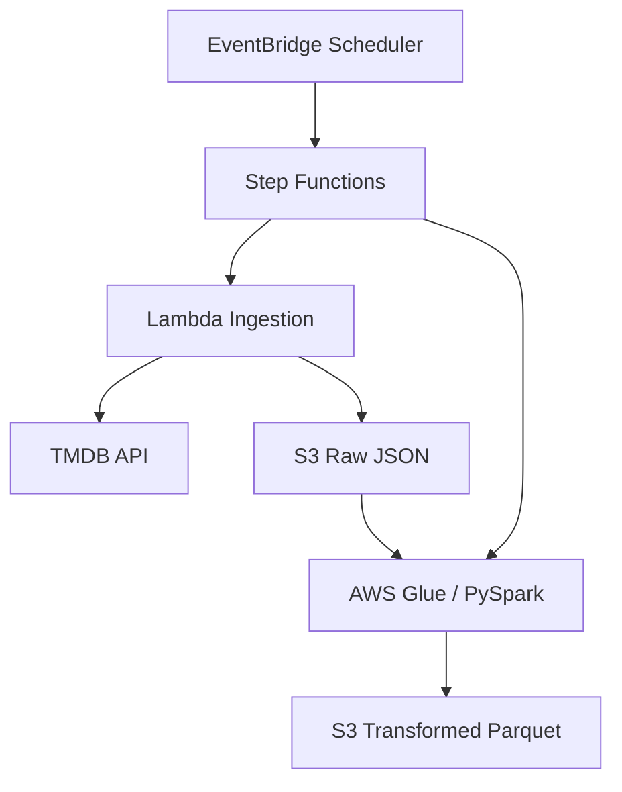
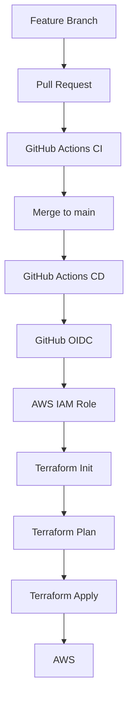

# TMDB Data Platform

A production-style AWS data engineering pipeline that ingests movie data from the TMDB API, stores raw JSON in Amazon S3, transforms it with AWS Glue / PySpark into Parquet, orchestrates the workflow with AWS Step Functions, schedules execution with Amazon EventBridge Scheduler, and deploys infrastructure automatically with Terraform and GitHub Actions.

---

## Architecture



### Runtime Flow

```text
EventBridge Scheduler
        ↓
Step Functions
        ↓
Lambda
        ↓
TMDB API
        ↓
S3 Raw JSON
        ↓
AWS Glue / PySpark
        ↓
S3 Transformed Parquet
```

The pipeline runs daily at **08:00 Asia/Kolkata**.

---

## Project Objective

The goal of this project was to build a complete cloud-based data pipeline instead of a standalone API script.

The platform:

- ingests movie data from the TMDB API
- stores the original response in a raw data layer
- transforms nested JSON using PySpark
- stores analytics-friendly Parquet files
- orchestrates ingestion and transformation
- runs automatically on a schedule
- provisions AWS infrastructure with Terraform
- stores Terraform state remotely in S3
- validates changes through GitHub Actions CI
- deploys merged changes automatically through GitHub Actions CD

---

## AWS Services Used

| Service | Purpose |
|---|---|
| AWS Lambda | Ingest movie data from TMDB |
| Amazon S3 | Raw and transformed data lake storage |
| AWS Glue | PySpark transformation job |
| AWS Step Functions | Pipeline orchestration |
| Amazon EventBridge Scheduler | Daily pipeline trigger |
| AWS Secrets Manager | Store TMDB bearer token |
| AWS IAM | Service roles and deployment permissions |
| Amazon CloudWatch | Runtime logs |
| Terraform | Infrastructure as Code |
| GitHub Actions | CI/CD automation |
| GitHub OIDC | Secure AWS authentication from GitHub |

---

## Data Flow

### 1. EventBridge Scheduler

Amazon EventBridge Scheduler starts the pipeline every day.

```text
Schedule: cron(0 8 * * ? *)
Timezone: Asia/Kolkata
```

It triggers the AWS Step Functions state machine.

Scheduler retry configuration:

```text
Maximum event age: 3600 seconds
Maximum retry attempts: 3
```

These retries apply only to delivery of the Step Functions execution request.

---

### 2. Step Functions

Step Functions orchestrates the pipeline.

```text
IngestMovies
      ↓
TransformMovies
```

The Lambda task uses:

```text
arn:aws:states:::lambda:invoke
```

The Glue task uses:

```text
arn:aws:states:::glue:startJobRun.sync
```

The `.sync` integration makes Step Functions wait until the Glue job finishes before completing the workflow.

---

### 3. Lambda Ingestion

The Lambda function:

1. retrieves the TMDB bearer token from Secrets Manager
2. creates the TMDB API client
3. calls the TMDB popular movies endpoint
4. receives JSON data
5. writes the raw response to Amazon S3

Current endpoint:

```text
/movie/popular
page=1
language=en-US
```

Raw S3 object:

```text
s3://tmdb-data-platform/raw/tmdb/popular/page=1.json
```

---

### 4. AWS Glue / PySpark Transformation

The Glue job reads the raw JSON, flattens the nested `results` array, selects required movie fields, and writes Parquet output.

Selected fields:

```text
id
title
original_language
release_date
popularity
vote_average
vote_count
```

Output location:

```text
s3://tmdb-data-platform/transformed/movies/
```

Output format:

```text
Apache Parquet
Compression: Snappy
```

Glue configuration:

```text
Glue version: 5.0
Worker type: G.1X
Workers: 2
Timeout: 8 minutes
```

---

## Data Lake Design

Application bucket:

```text
tmdb-data-platform
```

Logical structure:

```text
tmdb-data-platform/
│
├── raw/
│   └── tmdb/
│       └── popular/
│           └── page=1.json
│
├── transformed/
│   └── movies/
│       └── *.snappy.parquet
│
└── scripts/
    └── glue/
        └── transform_movies.py
```

### Raw Layer

The raw layer keeps the original TMDB API response in JSON format.

This supports:

- source-data preservation
- reprocessing
- debugging
- separation between ingestion and transformation

### Transformed Layer

The transformed layer stores cleaned movie records in Parquet format.

Parquet was selected because it provides:

- columnar storage
- compression
- efficient analytical reads
- compatibility with Spark and future warehouse workloads

---

## Secrets Management

The TMDB bearer token is stored in AWS Secrets Manager.

Secret name:

```text
tmdb-data-platform-api-credentials
```

The secret value is not stored in source code.

At runtime, Lambda retrieves it using:

```text
secretsmanager:GetSecretValue
```

---

## IAM Design

Separate IAM roles are used for the main AWS services.

### Lambda Role

Allows Lambda to:

- read the TMDB secret
- write raw data to S3
- write CloudWatch logs

### Glue Role

Allows Glue to:

- list the S3 bucket
- read raw data
- read the Glue script
- write transformed data

### Step Functions Role

Allows Step Functions to:

```text
lambda:InvokeFunction
glue:StartJobRun
glue:GetJobRun
glue:GetJobRuns
glue:BatchStopJobRun
```

### EventBridge Scheduler Role

Allows:

```text
states:StartExecution
```

for the Step Functions state machine.

### GitHub Actions Role

GitHub Actions assumes:

```text
tmdb-data-platform-github-actions
```

using OpenID Connect.

This avoids storing long-lived AWS access keys in GitHub.

---

## Terraform Infrastructure

Terraform is split into two root modules.

```text
infra/
├── bootstrap/
│   ├── main.tf
│   ├── github_oidc.tf
│   └── .terraform.lock.hcl
│
└── terraform/
    ├── versions.tf
    ├── providers.tf
    ├── s3.tf
    ├── secrets.tf
    ├── iam.tf
    ├── lambda.tf
    ├── glue.tf
    ├── step_functions.tf
    ├── eventbridge.tf
    └── .terraform.lock.hcl
```

### Bootstrap Terraform

The bootstrap module creates foundational resources:

- Terraform remote-state S3 bucket
- S3 versioning
- S3 server-side encryption
- S3 public-access protection
- GitHub OIDC provider
- GitHub Actions deployment IAM role

### Main Terraform

The main Terraform module manages:

- application S3 bucket
- Secrets Manager secret
- Lambda
- Glue
- Step Functions
- EventBridge Scheduler
- IAM roles and policies
- Glue script upload

---

## Terraform Remote State

Remote-state bucket:

```text
tmdb-data-platform-terraform-state
```

Backend configuration:

```text
bucket = "tmdb-data-platform-terraform-state"
key    = "tmdb-data-platform/terraform.tfstate"
region = "ap-south-1"
```

S3 native locking is enabled using:

```text
use_lockfile = true
```

This allows GitHub Actions to use the same Terraform state safely during deployment.

---

## Lambda Packaging

Lambda packaging is handled by:

```text
scripts/build_lambda.sh
```

The script:

1. removes the previous build
2. installs Python dependencies
3. copies the application package
4. creates:

```text
infra/terraform/lambda.zip
```

Terraform uses the ZIP hash to detect Lambda code changes.

---

## Git Workflow

The project follows a feature-branch workflow.

```text
main
 ↓
feature branch
 ↓
commit
 ↓
push
 ↓
pull request
 ↓
GitHub Actions CI
 ↓
review / validation
 ↓
squash merge
 ↓
main
```

Major implementation phases included:

- Python project initialization
- TMDB API client
- Terraform foundation
- Lambda ingestion
- Step Functions
- Glue transformation
- Glue orchestration
- EventBridge Scheduler
- Terraform remote state
- GitHub OIDC
- GitHub Actions CI/CD

---

## GitHub Actions CI/CD



Workflow files:

```text
.github/workflows/
├── ci.yml
└── deploy.yml
```

### CI Workflow

Runs on pull requests targeting `main`.

It performs:

- repository checkout
- Python 3.14 setup
- project installation
- Python syntax validation
- Lambda package build
- Terraform setup
- `terraform fmt -check`
- `terraform init -backend=false`
- `terraform validate`

`-backend=false` is used because pull-request CI only validates Terraform configuration and should not access production state.

### CD Workflow

Runs after code is merged into `main`.

It performs:

- repository checkout
- Python setup
- Lambda package build
- Terraform setup
- GitHub OIDC authentication
- AWS IAM role assumption
- `terraform init`
- `terraform plan`
- `terraform apply`

Deployment permissions:

```yaml
permissions:
  id-token: write
  contents: read
```

---

## GitHub OIDC Authentication

Authentication flow:

```text
GitHub Actions
      ↓
OIDC Token
      ↓
AWS IAM OIDC Provider
      ↓
AWS IAM Deployment Role
      ↓
Temporary AWS Credentials
      ↓
Terraform Deployment
```

Benefits:

- no static AWS keys in GitHub
- temporary credentials
- centralized IAM permissions
- safer CI/CD authentication

---

## Repository Structure

```text
tmdb-data-platform/
│
├── .github/
│   └── workflows/
│       ├── ci.yml
│       └── deploy.yml
│
├── infra/
│   ├── bootstrap/
│   └── terraform/
│
├── scripts/
│   └── build_lambda.sh
│
├── src/
│   ├── glue/
│   │   └── transform_movies.py
│   │
│   └── tmdb_pipeline/
│       ├── tmdb_client.py
│       └── lambda_handler.py
│
├── pyproject.toml
├── .gitignore
└── README.md
```

---

## Key Engineering Practices

- Infrastructure as Code with Terraform
- Remote Terraform state in S3
- Native S3 state locking
- Feature-branch development
- Pull-request-based CI
- Automated CD after merge
- GitHub OIDC authentication
- IAM service-role separation
- Secrets Manager for API credentials
- Raw and transformed data lake layers
- Parquet for analytics-friendly storage
- Step Functions workflow orchestration
- EventBridge scheduled batch execution

---

## Technologies Used

### Cloud

- AWS Lambda
- Amazon S3
- AWS Glue
- AWS Step Functions
- Amazon EventBridge Scheduler
- AWS Secrets Manager
- AWS IAM
- Amazon CloudWatch

### Data Engineering

- Python 3.14
- PySpark
- Apache Spark
- REST API
- JSON
- Apache Parquet
- Snappy

### DevOps / Infrastructure

- Terraform
- Git
- GitHub
- GitHub Actions
- OpenID Connect
- Bash
- Linux / WSL

---

## Skills Demonstrated

This project demonstrates hands-on experience with:

- cloud data pipeline architecture
- REST API ingestion
- serverless data engineering
- PySpark transformations
- JSON flattening
- Parquet generation
- AWS workflow orchestration
- scheduled batch processing
- IAM and secrets management
- Terraform Infrastructure as Code
- Terraform remote state
- CI/CD design
- GitHub Actions
- AWS OIDC federation
- automated AWS deployment

---

## Future Scope

A natural next phase is to extend the transformed data into a warehouse and data mart layer.

```text
S3 Transformed Parquet
        ↓
Amazon Redshift Serverless
        ↓
Staging Layer
        ↓
Dimensional Model
        ↓
Data Marts
        ↓
BI / Analytics
```

Possible future improvements:

- Redshift Serverless
- fact and dimension tables
- data marts
- pagination across TMDB pages
- incremental ingestion
- S3 partitioning
- data-quality checks
- Glue Data Catalog
- Athena
- CloudWatch alarms
- failure notifications
- environment separation
- reusable Terraform modules

---

## Project Status

**Completed and deployed successfully.**

Implemented runtime pipeline:

```text
EventBridge Scheduler
        ↓
Step Functions
        ↓
Lambda
        ↓
TMDB API
        ↓
S3 Raw JSON
        ↓
Glue / PySpark
        ↓
S3 Transformed Parquet
```

Implemented platform engineering:

```text
Terraform
+ S3 Remote State
+ S3 State Locking
+ GitHub Actions CI
+ GitHub Actions CD
+ AWS OIDC
+ IAM Service Roles
```

The full path from source code to AWS deployment is automated through GitHub Actions.
